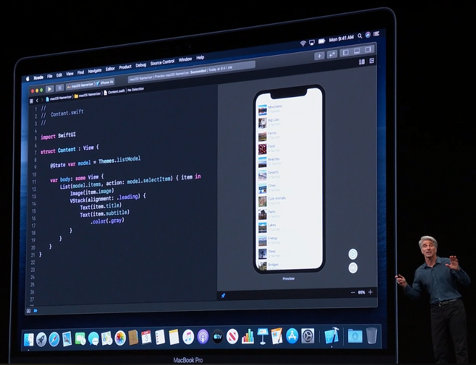
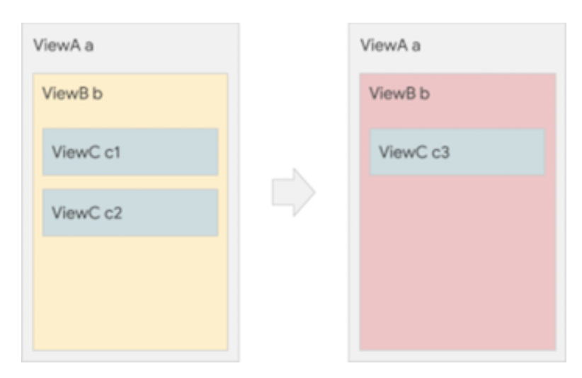
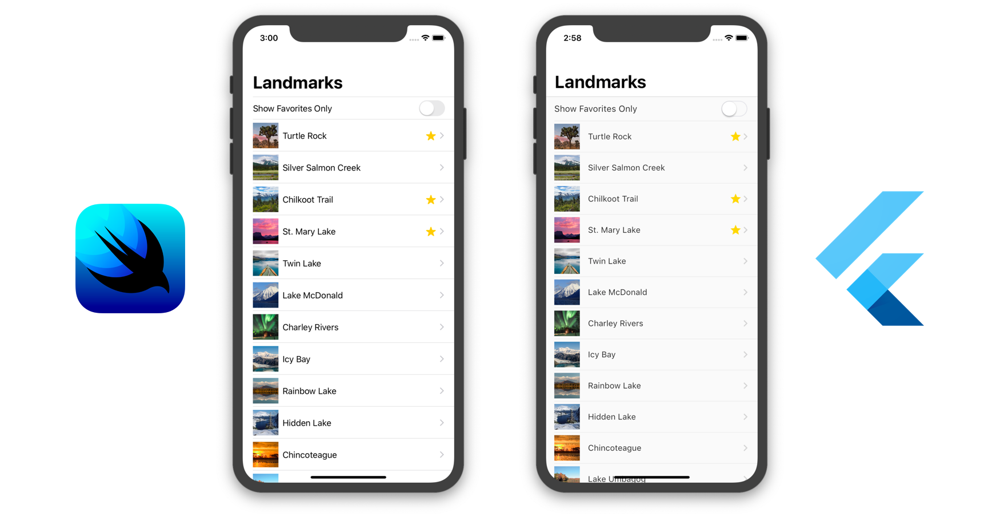
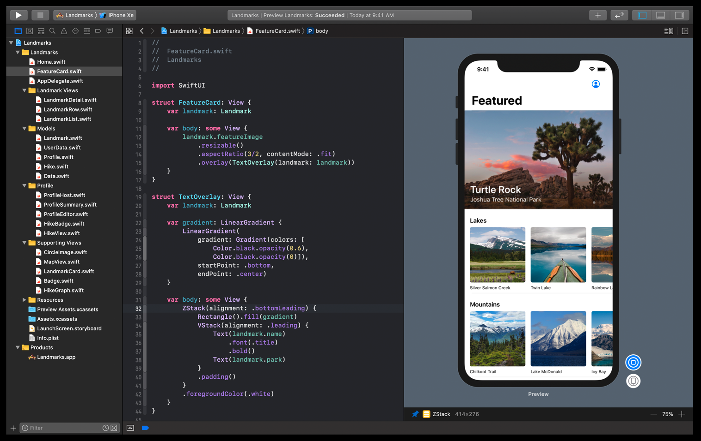
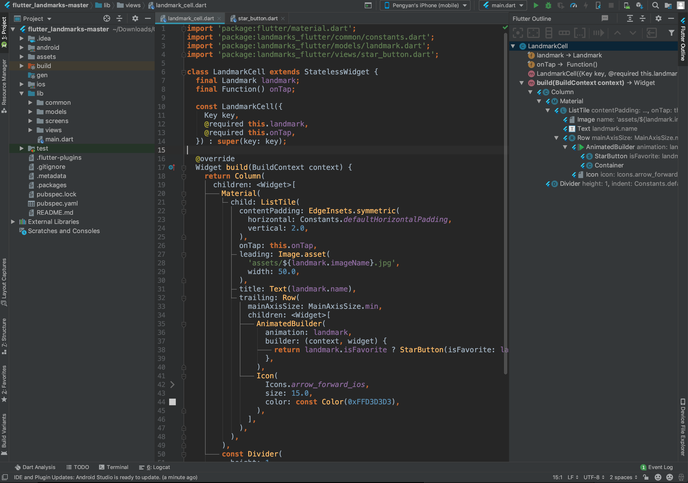
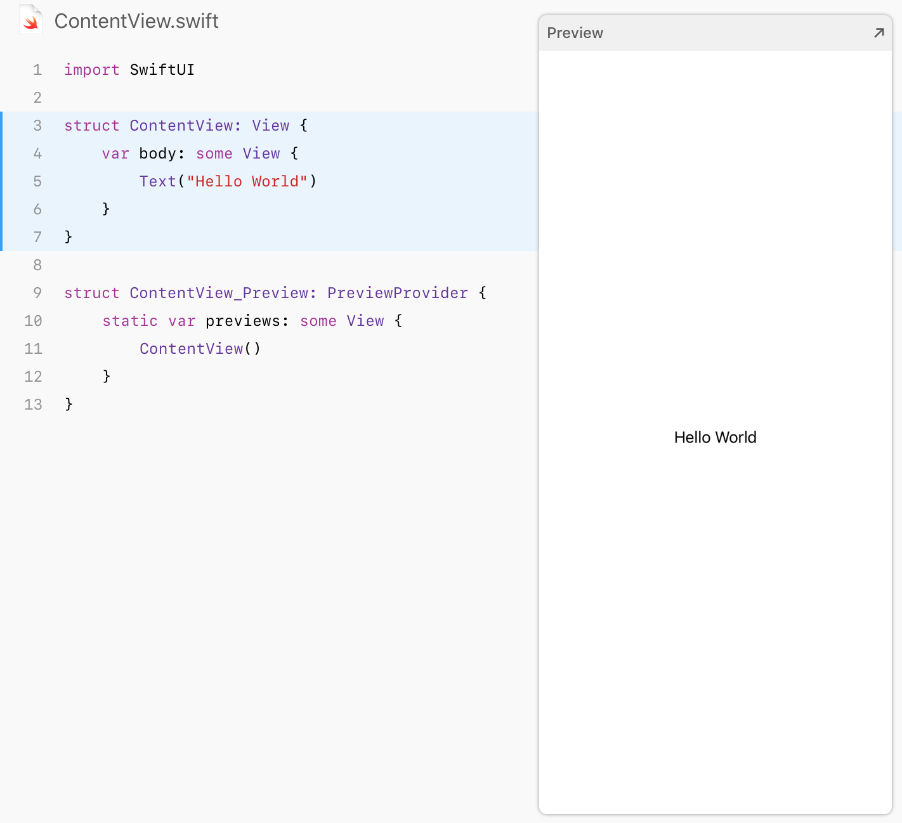
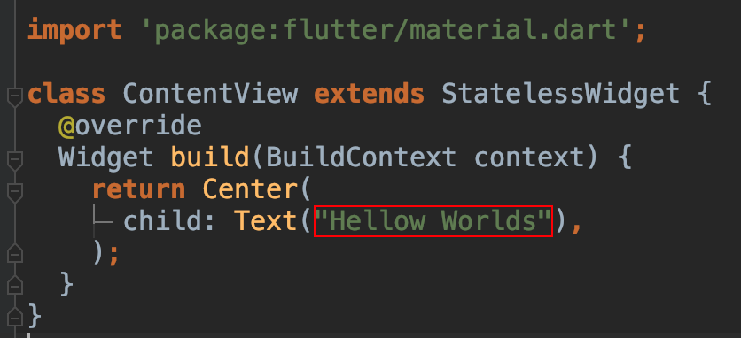
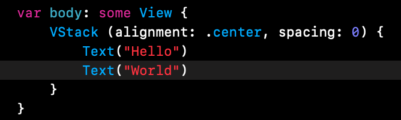
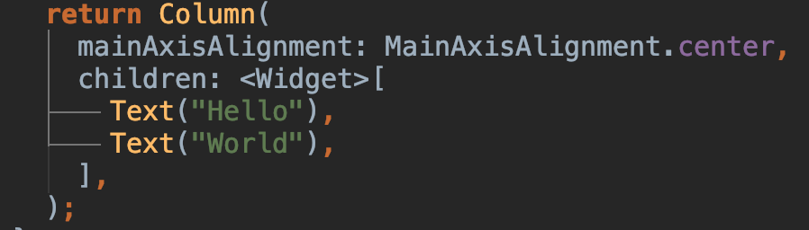

# 轻松对比SwiftUI 和 Flutter

## SwiftUI是什么



今年的WWDC苹果公布了许多大的更新和技术，这其中有一个令开发者非常兴奋的技术就是发布了SwiftUI。一个declarative UI框架用于构建iOS (iPadOS, macOS, watchOS, tvOS)应用。

为什么说开发者会很兴奋，这是因为苹果也加入了现代且先进的declarative UI编程。苹果的开发者们不用再坐在边上看React Native和Flutter带来的技术能力如：简化代码、提高开发效率的热更新而是也可以使用这些了。Google在今年的I/O‘19大会上发布了Jetpack Compose，一个新的Android declarative UI框架，所以苹果今年宣布SwiftUI正好赶在了这个间隙，引起开发者的共鸣。

我们见证了Facebook的React开启了持续的declarative UI编程的革命。Flutter正是把我们带入了这场革命并且Flutter的发展速度非常的快，在Stack Overflow，LinkedIn里它的热度都很高。那么SwiftUI的宣布又能说明什么哪？

## Flutter是什么
Flutter是谷歌的移动UI框架，可以快速在iOS和Android上构建高质量的原生用户界面。 Flutter可以与现有的代码一起工作。在全世界，Flutter正在被越来越多的开发者和组织使用，并且Flutter是完全免费、开源的。具有以下特点：

+ Declaraive UI
+ 快速开发
+ 原生的性能
+ 富有表现力，漂亮的用户界面
+ 统一的应用开发体验
+ 访问本地功能和SDK

## Declarative UI是什么

我们先来说说什么是declarative UI。众所周知现在的应用程序中写UI的代码是很复杂的一部分工作，在桌面、移动和Web应用中都需要处理下面这些UI相关的工作：响应式、设备旋转、动态字体大小、黑暗模式、不同主题、用户自定义、用户的角色许可和A/B测试等，然后又要配合各种的动画效果，并且最后要让用户和UI交互起来自然、简单和便捷。

在declarative UI之前你要做的是：

+ 首先通过UIView构建出登录界面
+ 当用户点击登录按钮时
+ 你会显示一个加载中的View，接着后台请求数据
+ 收据回来后，隐藏加载中的View
+ 重定位到主页或是弹出错误对话框

在这种被称为“imperative”的模式中，你根据各种事件去直接更改UI中的各个部分。这种模式的问题是，它看似简单但是在这个界面的业务和状态变的复杂时是很难保证在更新界面时不出现问题。

作为对比，“declarative”模式中，用户界面声明为一个有数据驱动的函数来展示，这里的数据是这个界面的状态(state)，当状态改变时UI会自动通知这个函数来更新展示。所以上面的登录例子变成：如果有用户显示主页，没有用户显示登录页；如果后台处理显示加载中；如果错误显示错误。

看下面的例子，如图我们要改变ViewB的子视图从左到右



+ Imperative的传统方法，首先找到ViewB的实例然后在它上面修改
	
	```
	ViewB b = getViewB
	b.setColor(red)
	b.clearChildren()
	ViewC c3 = new ViewC(...)
	b.add(c3)
	```
+ Declarative方法，直接返回声明的新ViewB

	```
	if (condition) {
		return ViewB(
			color: yellow,
			Childrens: [
				ViewC1,
				ViewC2
			]
		)
	}
	else {
		return ViewB(
			color: red,
			child: ViewC(...),
		)
	}
	```

## 两者的对比

接下来我们将通过苹果的SwiftUI课程对比一下SwiftUI和Flutter。这个课程用SwiftUI一步步的创建一个叫Landmarks的App，下面是苹果课程的地址：

[Apple SwiftUI示例](https://developer.apple.com/tutorials/swiftui/handling-user-input)

另外网上有开发者用Flutter作了一个高仿的Landmarks，我们这里将使用这个Flutter的Landmarks app做对比。下图是这个app的首页截图对比。




### IDE比较

+ XCode

	
	
	XCode对SwiftUI的支持是不用说的，从图中可以看出从左向右依次是工程列表、编辑文件和SwiftUI的预览Canvas。
	
+ Android Studio 

	

	左向右依次是工程列表、代码编辑器和Flutter的布局大纲。另外Visual Stuio Code也可以用于Flutter的开发在安装完Flutter的扩展后和Audroid Studio的功能基本一样，只是比Android Studio要轻量级一些。

	我们在苹果的SwiftUI课程中发现Xcode所带的这个预览功能还是十分强大的，在预览上做修改可以直接同步修改代码，并且这个预览界面还有编程的入口，可以通过代码修改预览行为也可以指定预览Canvas的大小或是直接指定设备，这整个过程都不用编译代码。相比Android Studio没有这方面的功能。我们还会在后面具体说一下预览的功能

### 界面元素

+ SwiftUI的View
	
	View是一个Protocal，SwiftUI中的自定义视图都要遵从与这个协议且必须实现body属性来提供你自定义视图的内容和行为。如下图所示代码会在屏幕中间显示文案Hello World!。这里的contenView继承与View接着实现了body属性。另外contenView_Previews结构是用于预览的代码，这里直接创建ContentView，可以直接在右边的预览中看到效果。

	
	
	View还定义了一些操作如：剪切、阴影、描边等。
	
+ Flutter的Widget

	类似的Flutter的UI元素都继承与Widget类，如下代码创建一个无状态的widget在屏幕中间输出Hello World!。它继承与StatelessWidget，StatelessWidget又继承与Widget。这里的build方法是必须实现且返回UI内容的。

	

	可以看到对于declarative UI的SwiftUI和Flutter这里创建一个自定义的UI基本一样，只是Flutter的stateful和stateless在SwiftUI中是没有的。另外Flutter没有实时预览所有也没有预览部分的代码。

### 布局

SwiftUI的Stacks对应Flutter的Flex widgets都是在一维上显示这些子内容。下表是他们对应关系

SwiftUI | Flutter | 描述 
---- | ---- | ----
HStack | Row | 行buju
VStack | Column | 列布局
ZStack | Stack | 重叠布局

如果要实现下面一个Hello world在屏幕中竖向排列居中显示代码如下：

Hello<br/>
World

SwiftUI



Flutter



从代码可以看出由于SwiftUI没有return语句和children参数而看齐单有简单点。但是Flutter对布局的命名Row、Column和Stack看起来更有感觉。

### 列表

UIKit的Table views在SwiftUI中是List。你可以把所有的子内容放在List里。这对比于UIKit的UITableView去实现多个代理方法是极大的进步。

在Flutter上你可以有多个选择，你可以用ListView来显示多行内容或是用SingleChildScrollView来显示一屏可以滚动的内容。更高级的可以用CustomScrollView它的子视图可以用一系列的Sliver widgets。

### 导航


### 使用Native元素


### 状态管理

+ SwiftUI

+ Flutter

### 总结

+ 代码复杂度

+ 兼容性


## 参考
苹果SwiftUI课程<br/>
https://developer.apple.com/tutorials/swiftui

苹果SwiftUI文档<br/>
https://developer.apple.com/documentation/swiftui

Building the SwiftUI Sample App in Flutter
https://github.com/VGVentures/flutter_landmarks


